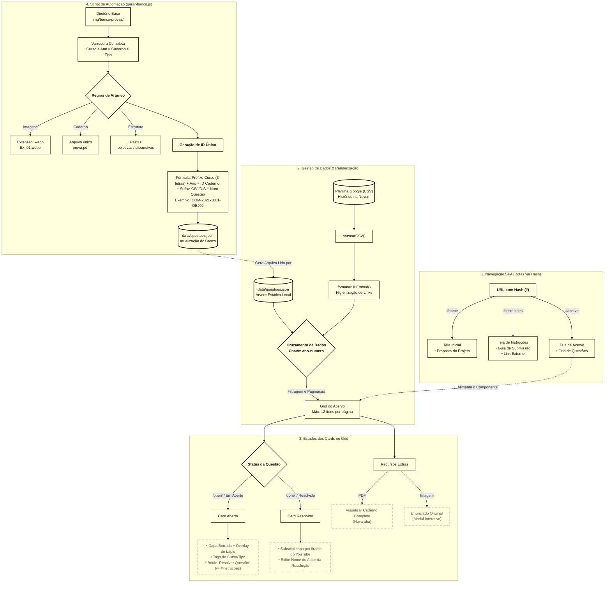

# Documentação Técnica e Fluxo de Informações: TechSI Prepare

Este documento mapeia o fluxo de experiência do usuário (UX/UI), a arquitetura de dados (integração entre CSV e JSON) e a organização do sistema de arquivos do projeto.

---

## 1. Fluxo de Experiência do Usuário (UX/UI)

O sistema opera como uma *Single Page Application* (SPA) com rotas geridas via hash na URL. As páginas válidas de navegação são `home`, `acervo` e `instrucoes`.

### 1.1. Tela Inicial (`#home`)

* **Objetivo:** Apresentar a proposta do projeto de extensão e converter visitantes em participantes.

### 1.2. Tela de Acervo (`#acervo`)

* **Objetivo:** Permitir a busca de questões para estudo ou captação de novas resoluções.
* **Filtros e Paginação:** O acervo possui filtros dinâmicos extraídos dos dados reais da planilha (como ano e status). A exibição em grid é controlada por uma paginação que limita a renderização a 12 itens por página (`ITEMS_PER_PAGE`).
* **Cards Dinâmicos:**
* **Em Aberto (`open`):** Exibe a imagem de capa (borrada), um ícone de lápis em overlay, tags indicando curso/tipo e um botão com a chamada "Resolver Questão", que direciona para a página de instruções.
* **Resolvido (`done`):** Substitui a capa da imagem por um `iframe` do vídeo do YouTube embutido, exibindo o nome do autor da resolução.


* **Recursos Extras:** O grid oferece botões para visualizar o caderno completo (PDF em nova aba) e abrir o enunciado original da questão em um Modal interativo nativo da página (`abrirModalImagem`).

### 1.3. Tela de Instruções (`#instrucoes`)

* **Objetivo:** Guiar o aluno no processo de gravação e submissão através de um formulário externo.

---

## 2. Gestão de Dados (API e Repositórios)

O sistema baseia-se na mescla simultânea de dois repositórios de dados para formar o Acervo: a árvore estática local e o histórico dinâmico na nuvem.

### 2.1. Fontes de Dados

* **Planilha Google (CSV):** Obtida via `URL_CSV`, contém os dados aprovados das resoluções (formulários validados).
* **Arquivo Local (JSON):** Obtido via `URL_QUESTOES_JSON` (`data/questoes.json`), atua como o banco de dados oficial que lista a existência de todos os cadernos e questões mapeadas no repositório.

### 2.2. Tratamento e Merge

* O sistema cruza as informações utilizando a chave única `${ano}-${numero}` para verificar se uma questão estática já possui resolução no CSV dinâmico.
* O CSV passa por um *parser* (`parsearCSV`) que varre as colunas e espera extrair os seguintes campos por linha: `ano`, `numero`, `assunto`, `autor` e `video_url`.
* As URLs do YouTube inseridas no CSV são higienizadas automaticamente (`formatarUrlEmbed`), convertendo links padrão (`watch?v=`) ou curtos (`youtu.be/`) em links de incorporação (`embed/`).

---

## 3. Estrutura de Pastas e Banco de Imagens

O repositório local de cadernos e recortes de questões deve seguir um padrão rígido de encapsulamento para garantir a automação.

> O diretório base para todo o armazenamento local é `./img/banco-provas/`.

```text
img/banco-provas/
└── [CURSO]/                                    # Ex: computacao, design
    └── [ANO]/                                  # Ex: 2017, 2021
        └── [CODIGO_CADERNO]/                   # Ex: 1801, 4501, ou caderno-unico
            ├── prova.pdf                       # O arquivo PDF inteiro do caderno
            └── questoes/                       # Pasta pai dos enunciados recortados
                ├── discursivas/                # Imagens de questões dissertativas
                │   ├── 01.webp
                │   └── 02.webp
                └── objetivas/                  # Imagens de múltipla escolha
                    ├── 09.webp
                    └── 10.webp

```

### 3.1. Regras de Arquivos

* **Padrão de Nomenclatura:** As imagens das questões devem ter extensão `.webp`. O nome do arquivo deve ser preferencialmente numérico (ex: `01.webp`), pois o script extrairá os dígitos para ordenação e montagem do identificador.
* **Nome do PDF:** O arquivo com o caderno inteiro da prova deve se chamar `prova.pdf` por padrão dentro de sua respectiva pasta.
* **Segregação de Tipos:** A pasta de questões ramifica obrigatoriamente entre `objetivas` e `discursivas`.

---

## 4. Automação: Geração do Banco Local (JSON)

Para evitar a inserção manual de novos cadernos no código, o projeto conta com um script Node.js (`gerar-banco.js`).

* **Funcionamento:** O script faz uma varredura completa nas pastas dentro de `img/banco-provas/`.
* **Montagem da Árvore:** Para cada pasta reconhecida (Curso > Ano > Caderno > Tipo), o script constrói um nó em uma árvore de dados.
* **ID Único:** Ele injeta em cada questão um `id` único composto por: Prefixo do Curso (3 letras) + Ano + ID do Caderno + Sufixo do Tipo (`OBJ` ou `DIS`) + Número da Questão. *(Exemplo gerado: `COM-2021-1801-OBJ09`)*. Casos de cadernos sem código recebem a *flag* `UNI` (caderno-unico).
* **Resultado:** O output final é o arquivo `data/questoes.json`, que o frontend consumirá para renderizar a base de dados.

