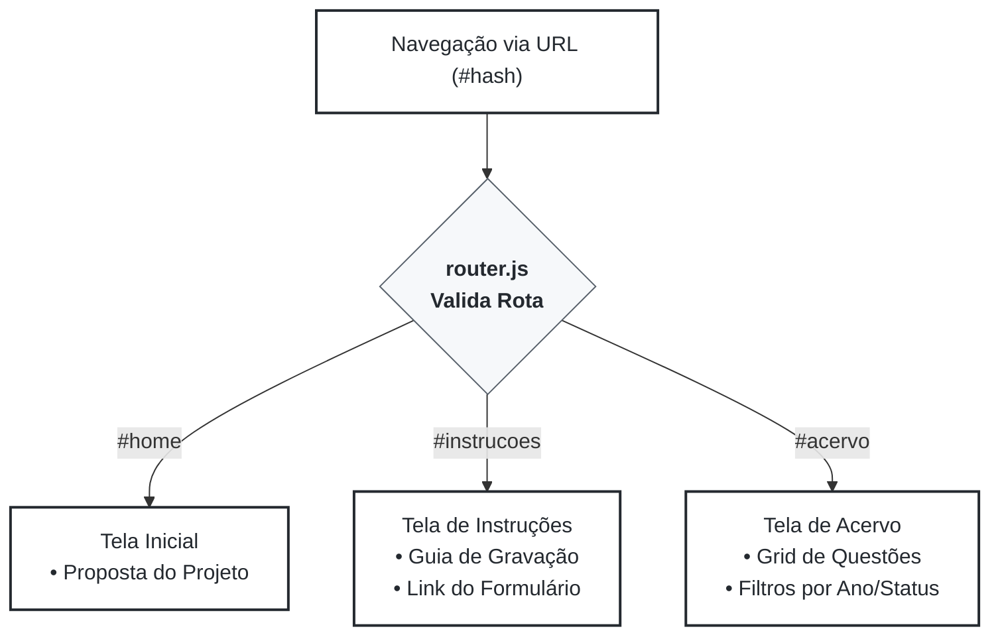
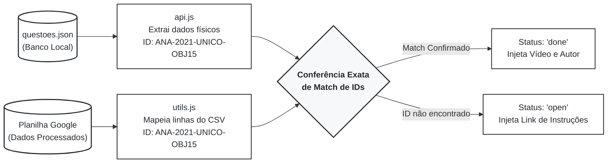
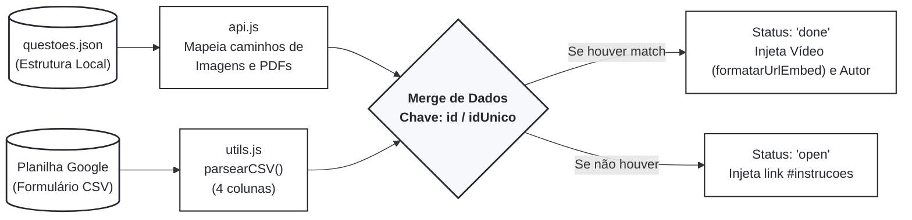
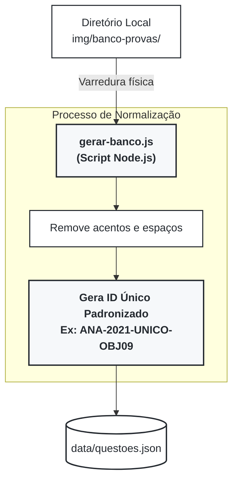

# Documentação Técnica e Fluxo de Informações: TechSI Prepare

Este documento mapeia o fluxo de experiência do usuário (UX/UI), a arquitetura de dados (integração entre CSV e JSON) e a organização do sistema de arquivos do projeto.

---

## 1. Fluxo de Experiência do Usuário (UX/UI)

O sistema opera como uma *Single Page Application* (SPA) com rotas geridas via hash na URL. As páginas válidas de navegação são `home`, `acervo` e `instrucoes`.

### 1.1. Tela Inicial (`#home`)

* **Objetivo:** Apresentar a proposta do projeto de extensão e converter visitantes em participantes.

### 1.2. Tela de Acervo (`#acervo`)

* **Objetivo:** Permitir a busca de questões para estudo ou captação de novas resoluções.
* **Filtros e Paginação:** O acervo possui filtros dinâmicos extraídos dos dados reais da planilha (como ano e status). A exibição em grid é controlada por uma paginação que limita a renderização a 12 itens por página (`ITEMS_PER_PAGE`).
* **Cards Dinâmicos:**
* **Em Aberto (`open`):** Exibe a imagem de capa (borrada), um ícone de lápis em overlay, tags indicando curso/tipo e um botão com a chamada "Resolver Questão", que direciona para a página de instruções.
* **Resolvido (`done`):** Substitui a capa da imagem por um `iframe` do vídeo do YouTube embutido, exibindo o nome do autor da resolução.


* **Recursos Extras:** O grid oferece botões para visualizar o caderno completo (PDF em nova aba) e abrir o enunciado original da questão em um Modal interativo nativo da página (`abrirModalImagem`).

### 1.3. Tela de Instruções (`#instrucoes`)

* **Objetivo:** Guiar o aluno no processo de gravação e submissão através de um formulário externo.



---

## 2. Gestão de Dados (API e Cruzamento de IDs)

O sistema baseia-se na mescla simultânea de dois repositórios de dados para formar o Acervo: a árvore estática local e o histórico dinâmico na nuvem.

### 2.1. Fontes de Dados

* **Planilha Google (CSV):** Obtida via `URL_CSV`, atua como o banco de dados dinâmico das resoluções aprovadas.
* **Arquivo Local (JSON):** Obtido via `URL_QUESTOES_JSON` (`data/questoes.json`), atua como o mapa oficial da estrutura de pastas físicas locais.

### 2.2. O Mecanismo de Conferência de IDs

O coração do sistema é o cruzamento direto de chaves utilizando um Identificador Único (`idUnico`). Em vez de checar múltiplos parâmetros, o frontend e a automação geram uma string padronizada, em maiúsculas, livre de acentos e espaços.

**A anatomia do ID segue o padrão:** `[PREFIXO DO CURSO]-[ANO]-[CADERNO]-[TIPO][NÚMERO]`
* Exemplo para Caderno Geral: `ANA-2021-UNICO-OBJ15`
* Exemplo para Caderno Específico: `ANA-2018-1801-DIS02`

O frontend faz o mapeamento criando uma coleção do tipo `Map` em memória com o ID do CSV. Ao percorrer a árvore do arquivo JSON, ele confere instantaneamente se o ID do banco local dá "match" com alguma chave registrada na planilha, injetando o vídeo correspondente e alterando o status da questão para resolvido (`done`).



### 2.3. Estruturação e Fórmulas da Planilha (Google Sheets)

A planilha do Google Sheets atua como a esteira de higienização de dados e deve ser separada em duas abas:

1. **`Form_Responses`:** Guarda as respostas puras enviadas pelos alunos através do Google Forms.
2. **`Dados_Processados`:** É a aba oficial publicada como `.csv` para o sistema. Ela deve conter exatamente as seguintes 4 colunas:

| Coluna | Cabeçalho | Expressão / Fórmula (Aplicar na linha 2 e arrastar para baixo) |
| --- | --- | --- |
| **A** | `ID Questão` | `=IF(Form_Responses!A2=""; ""; LEFT(SUBSTITUTE(SUBSTITUTE(SUBSTITUTE(SUBSTITUTE(SUBSTITUTE(SUBSTITUTE(SUBSTITUTE(UPPER(Form_Responses!F2); "Á"; "A"); "Ã"; "A"); "Â"; "A"); "É"; "E"); "Í"; "I"); "Ó"; "O"); " "; ""); 3) & "-" & Form_Responses!G2 & "-" & Form_Responses!H2 & "-OBJ" & TEXT(Form_Responses!I2; "00"))` |
| **B** | `Nome Completo` | `=IF(Form_Responses!A2=""; ""; Form_Responses!C2)` |
| **C** | `Assunto Principal` | `=IF(Form_Responses!A2=""; ""; Form_Responses!J2)` |
| **D** | `URL do Vídeo` | `=IF(Form_Responses!A2=""; ""; Form_Responses!K2)` |

---

## 3. Gestão de Dados (API e Repositórios)

O sistema baseia-se na mescla simultânea de dois repositórios de dados para formar o Acervo: a árvore estática local e o histórico dinâmico na nuvem.

### 3.1. Fontes de Dados

* **Planilha Google (CSV):** Obtida via `URL_CSV`, contém os dados aprovados das resoluções (formulários validados).
* **Arquivo Local (JSON):** Obtido via `URL_QUESTOES_JSON` (`data/questoes.json`), atua como o banco de dados oficial que lista a existência de todos os cadernos e questões mapeadas no repositório.

### 3.2. Tratamento e Merge

* O sistema cruza as informações utilizando o Identificador Único da questão, realizando uma busca exata entre o `id` gerado localmente na árvore de questões e o `idUnico` extraído do banco de dados na nuvem.
* O CSV passa por um *parser* (`parsearCSV`) preparado para processar uma estrutura de exatamente 4 colunas por linha, extraindo os campos: `idUnico` (Coluna A), `autor` (Coluna B), `assunto` (Coluna C) e `video_url` (Coluna D).
* As URLs do YouTube inseridas no CSV são higienizadas e padronizadas no frontend pela função `formatarUrlEmbed`, que converte links padrão de navegador (`watch?v=`) ou links curtos de compartilhamento (`youtu.be/`) em links de incorporação seguros (`embed/`).



> Exemplo de objeto JSON:

```json
[
  {
    "curso": "computacao",
    "anos": [
      {
        "ano": 2005,
        "cadernos": [
          {
            "codigo": "UNICO",
            "pdf_arquivo": "prova.pdf",
            "objetivas": [
              {
                "id": "COM-2005-UNICO-OBJ41",
                "numero": 41,
                "arquivo": "41.webp"
              }
            ],
            "discursivas": []
          }
        ]
      }
    ]
  }
]

```

---

## 4. Estrutura de Pastas e Banco de Imagens

O repositório local de cadernos e recortes de questões deve seguir um padrão rígido de encapsulamento para garantir a automação.

> O diretório base para todo o armazenamento local é `./img/banco-provas/`.

```text
img/banco-provas/
└── [CURSO]/                                    # Ex: computacao, analise-e-desenv
    └── [ANO]/                                  # Ex: 2017, 2021
        └── [CODIGO_CADERNO]/                   # Ex: 1801, ou UNICO
            ├── prova.pdf                       # O arquivo PDF inteiro do caderno
            └── questoes/                       # Pasta pai dos enunciados recortados
                ├── discursivas/                # Imagens de questões dissertativas
                └── objetivas/                  # Imagens de múltipla escolha
                    ├── 09.webp
                    └── 10.webp

```

### 4.1. Regras de Arquivos

* **Padrão de Nomenclatura:** As imagens das questões devem ter extensão `.webp`. O nome do arquivo deve ser preferencialmente numérico (ex: `01.webp`), pois o script extrairá os dígitos para ordenação e formatação.
* **Nome do PDF:** O arquivo com o caderno inteiro da prova deve se chamar `prova.pdf`.
* **Segregação de Tipos:** A pasta de questões ramifica obrigatoriamente entre `objetivas` e `discursivas`.

---

## 5. Automação: Geração do Banco Local (JSON)

Para evitar a inserção manual de novos cadernos no código, o projeto conta com um script Node.js (`gerar-banco.js`).

* **Funcionamento:** O script faz uma varredura completa nas pastas dentro de `img/banco-provas/`.
* **Normalização Anti-Erros:** Ao ler o nome das pastas de Cursos (Ex: `analise-e-desenvolvimento`), o script converte para maiúsculo, desmembra caracteres acentuados (`normalize('NFD')`), remove acentos gráficos e limpa espaços/hifens, garantindo um prefixo de 3 letras puro (Ex: `ANA`).
* **Montagem da Árvore e ID:** Ele injeta em cada questão o identificador único resultante, herdando diretamente o nome da pasta do caderno (`idCaderno`). O número da questão ganha padding de zeros (Ex: 05).
* **Resultado:** O output final é o arquivo `data/questoes.json`, que atua como o banco de espelhos a ser cruzado com o Google Sheets.

